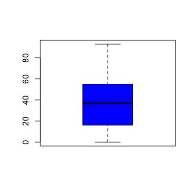
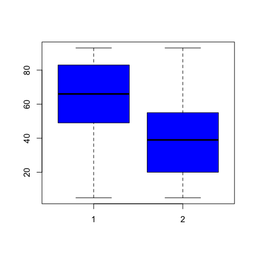
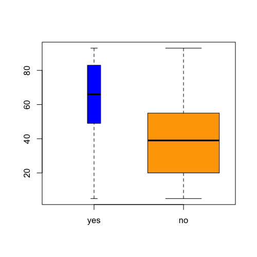
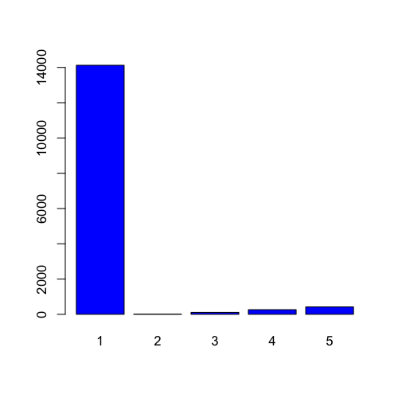
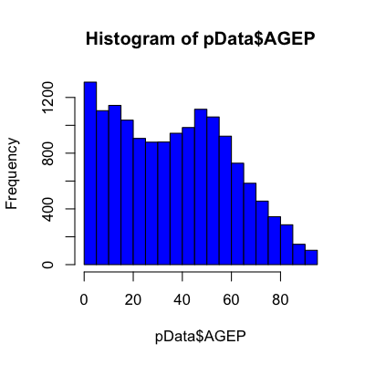
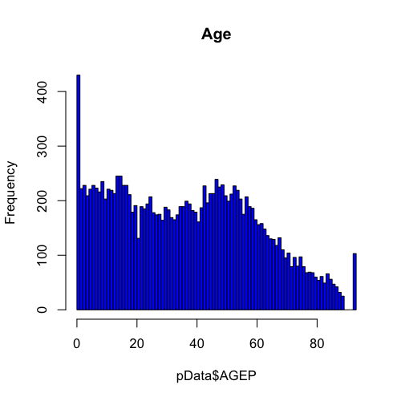
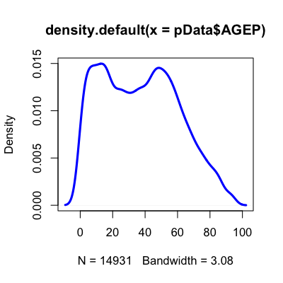
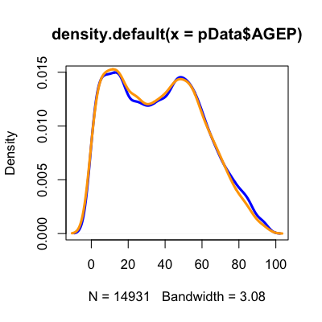

## Why do we use graphs in data analysis? 

* To understand data properties
* To find patterns in data
* To suggest modeling strategies
* To "debug" analyses
* To communicate results

---

## Exploratory graphs

* <redtext>To understand data properties</redtext>
* <redtext>To find patterns in data</redtext>
* <redtext>To suggest modeling strategies</redtext>
* <redtext>To "debug" analyses</redtext>
* To communicate results

---

## Characteristics of exploratory graphs

* They are made quickly
* A large number are made
* The goal is for personal understanding
* Axes/legends are generally cleaned up
* Color/size are primarily used for information

---

## Background - perceptual tasks


[Graphical perception: Theory, Experimentation, and Applications to the Development of Graphical Models](http://www.jstor.org/discover/10.2307/2288400?uid=3739704&uid=2&uid=4&uid=3739256&sid=21101742782357)

---

## Position versus length


[Graphical perception: Theory, Experimentation, and Applications to the Development of Graphical Models](http://www.jstor.org/discover/10.2307/2288400?uid=3739704&uid=2&uid=4&uid=3739256&sid=21101742782357)


---

## Position versus length - results


[Graphical perception: Theory, Experimentation, and Applications to the Development of Graphical Models](http://www.jstor.org/discover/10.2307/2288400?uid=3739704&uid=2&uid=4&uid=3739256&sid=21101742782357)

---

## Position versus angle


[Graphical perception: Theory, Experimentation, and Applications to the Development of Graphical Models](http://www.jstor.org/discover/10.2307/2288400?uid=3739704&uid=2&uid=4&uid=3739256&sid=21101742782357)


---

## Position versus angle - results


<br><br>
[Graphical perception: Theory, Experimentation, and Applications to the Development of Graphical Models](http://www.jstor.org/discover/10.2307/2288400?uid=3739704&uid=2&uid=4&uid=3739256&sid=21101742782357)


---

## More experimental results


[Graphical Perception and Graphical Methods for Analyzing Scientific Data](http://www.sciencemag.org/content/229/4716/828.refs)

---

## Summary

* Use common scales when possible
* When possible use position comparisons
* Angle comparisons are frequently hard to interpret (no piecharts!)
* No 3-D barcharts


---

## Housing data


<br>


```r
pData <- read.csv("./data/ss06pid.csv")
```


--- 

## Boxplots

* Important parameters: _col_,_varwidth_,_names_,_horizontal_

```r
boxplot(pData$AGEP,col="blue")
```

<div class="rimage center"></div>


--- 

## Boxplots


```r
boxplot(pData$AGEP ~ as.factor(pData$DDRS),col="blue")
```

<div class="rimage center"></div>


--- 

## Boxplots


```r
boxplot(pData$AGEP ~ as.factor(pData$DDRS),col=c("blue","orange"),names=c("yes","no"),varwidth=TRUE)
```

<div class="rimage center"></div>


--- 

## Barplots


```r
barplot(table(pData$CIT),col="blue")
```

<div class="rimage center"></div>


--- 

## Histograms

* Important parameters: _breaks_,_freq_,_col_,_xlab_,_ylab_, _xlim, _ylim_ ,_main_

```r
hist(pData$AGEP,col="blue")
```

<div class="rimage center"></div>


--- 

## Histograms


```r
hist(pData$AGEP,col="blue",breaks=100,main="Age")
```

<div class="rimage center"></div>


--- 

## Density plots

Important parameters (to plot): _col_,_lwd_,_xlab_,_ylab_,_xlim_,_ylim_

```r
dens <- density(pData$AGEP)
plot(dens,lwd=3,col="blue")
```

<div class="rimage center"></div>


--- 

## Density plots - multiple distributions


```r
dens <- density(pData$AGEP)
densMales <- density(pData$AGEP[which(pData$SEX==1)])
plot(dens,lwd=3,col="blue")
lines(densMales,lwd=3,col="orange")
```

<div class="rimage center"></div>


