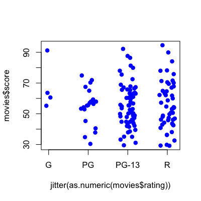
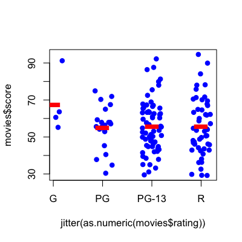
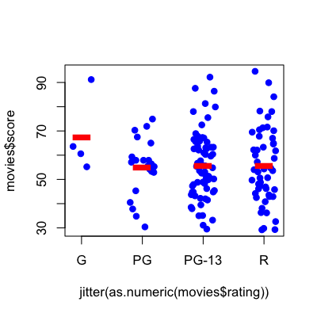

## Key ideas

* Outcome is still quantitative
* Covariate(s) are factor variables
* Fitting lines = fitting means
* Want to evaluate contribution of all factor levels at once


---

## Example: Movie ratings


[http://www.rottentomatoes.com/](http://www.rottentomatoes.com/)


---

## Movie Data


```r
download.file("http://www.rossmanchance.com/iscam2/data/movies03RT.txt",destfile="./data/movies.txt")
movies <- read.table("./data/movies.txt",sep="\t",header=T,quote="")
head(movies)
```

```
                 X score rating            genre box.office running.time
1 2 Fast 2 Furious  48.9  PG-13 action/adventure     127.15          107
2    28 Days Later  78.2      R           horror      45.06          113
3      A Guy Thing  39.5  PG-13       rom comedy      15.54          101
4      A Man Apart  42.9      R action/adventure      26.25          110
5    A Mighty Wind  79.9  PG-13           comedy      17.78           91
6 Agent Cody Banks  57.9     PG action/adventure      47.81          102
```


[http://www.rossmanchance.com/](http://www.rossmanchance.com/)

---

## Rotton tomatoes score vs. rating


```r
plot(movies$score ~ jitter(as.numeric(movies$rating)),col="blue",xaxt="n",pch=19)
axis(side=1,at=unique(as.numeric(movies$rating)),labels=unique(movies$rating))
```

<div class="rimage center"></div>


---

## Average score by rating


```r
plot(movies$score ~ jitter(as.numeric(movies$rating)),col="blue",xaxt="n",pch=19)
axis(side=1,at=unique(as.numeric(movies$rating)),labels=unique(movies$rating))
meanRatings <- tapply(movies$score,movies$rating,mean)
points(1:4,meanRatings,col="red",pch="-",cex=5)
```

<div class="rimage center"></div>


---

## Another way to write it down

<br><br>

$$S_i = b_0 + b_1 \mathbb{1}(Ra_i="PG") + b_2 \mathbb{1}(Ra_i="PG-13") + b_3 \mathbb{1}(Ra_i="R") + e_i $$

<br><br>

The notation $\mathbb{1}(Ra_i="PG")$ is a logical value that is one if the movie rating is "PG" and zero otherwise.


__Average values__

$b_0$ = average of the G movies

$b_0 + b_1$ = average of the PG movies

$b_0 + b_2$ = average of the PG-13 movies

$b_0 + b_3$ = average of the R movies

---

## Here is how you do it in R


```r
lm1 <- lm(movies$score ~ as.factor(movies$rating))
summary(lm1)
```

```

Call:
lm(formula = movies$score ~ as.factor(movies$rating))

Residuals:
   Min     1Q Median     3Q    Max 
-26.43  -9.98  -0.98   9.34  38.97 

Coefficients:
                              Estimate Std. Error t value Pr(>|t|)    
(Intercept)                      67.65       7.19    9.40   <2e-16 ***
as.factor(movies$rating)PG      -12.59       7.85   -1.60     0.11    
as.factor(movies$rating)PG-13   -11.81       7.41   -1.59     0.11    
as.factor(movies$rating)R       -12.02       7.48   -1.61     0.11    
---
Signif. codes:  0 '***' 0.001 '**' 0.01 '*' 0.05 '.' 0.1 ' ' 1 

Residual standard error: 14.4 on 136 degrees of freedom
Multiple R-squared: 0.0199,	Adjusted R-squared: -0.00177 
F-statistic: 0.918 on 3 and 136 DF,  p-value: 0.434 

```


---

## Plot fitted values


```r
plot(movies$score ~ jitter(as.numeric(movies$rating)),col="blue",xaxt="n",pch=19)
axis(side=1,at=unique(as.numeric(movies$rating)),labels=unique(movies$rating))
points(1:4,lm1$coeff[1] + c(0,lm1$coeff[2:4]),col="red",pch="-",cex=5)
```

<div class="rimage center"></div>


---

## Question 1

__Average values__

$b_0$ = average of the G movies

$b_0 + b_1$ = average of the PG movies

$b_0 + b_2$ = average of the PG-13 movies

$b_0 + b_3$ = average of the R movies


__What is the average difference in rating between G and R movies?__

$b_0 + b_3 - b_0$ = $b_3$

---

## Question 1 in R 


```r
lm1 <- lm(movies$score ~ as.factor(movies$rating))
summary(lm1)
```

```

Call:
lm(formula = movies$score ~ as.factor(movies$rating))

Residuals:
   Min     1Q Median     3Q    Max 
-26.43  -9.98  -0.98   9.34  38.97 

Coefficients:
                              Estimate Std. Error t value Pr(>|t|)    
(Intercept)                      67.65       7.19    9.40   <2e-16 ***
as.factor(movies$rating)PG      -12.59       7.85   -1.60     0.11    
as.factor(movies$rating)PG-13   -11.81       7.41   -1.59     0.11    
as.factor(movies$rating)R       -12.02       7.48   -1.61     0.11    
---
Signif. codes:  0 '***' 0.001 '**' 0.01 '*' 0.05 '.' 0.1 ' ' 1 

Residual standard error: 14.4 on 136 degrees of freedom
Multiple R-squared: 0.0199,	Adjusted R-squared: -0.00177 
F-statistic: 0.918 on 3 and 136 DF,  p-value: 0.434 

```


---

## Question 1 in R 


```r
lm1 <- lm(movies$score ~ as.factor(movies$rating))
confint(lm1)
```

```
                               2.5 % 97.5 %
(Intercept)                    53.42 81.875
as.factor(movies$rating)PG    -28.11  2.928
as.factor(movies$rating)PG-13 -26.47  2.842
as.factor(movies$rating)R     -26.80  2.763
```


---

## Question 2

__Average values__

$b_0$ = average of the G movies

$b_0 + b_1$ = average of the PG movies

$b_0 + b_2$ = average of the PG-13 movies

$b_0 + b_3$ = average of the R movies


__What is the average difference in rating between $PG-13$ and $R$ movies?__

$b_0 + b_2 - (b_0 + b_3)$ = $b_2-b_3$


---

## We could rewrite our model


$$S_i = b_0 + b_1 \mathbb{1}(Ra_i="G") + b_2 \mathbb{1}(Ra_i="PG") + b_3 \mathbb{1}(Ra_i="PG-13") + e_i $$

<br><br>


__Average values__

$b_0$ = average of the R movies

$b_0 + b_1$ = average of the G movies

$b_0 + b_2$ = average of the PG movies

$b_0 + b_3$ = average of the PG-13 movies

__What is the average difference in rating between $PG-13$ and $R$ movies?__

$b_0 + b_3 - b_0$ = $b_3$


---

## Question 2 in R


```r
lm2 <- lm(movies$score ~ relevel(movies$rating,ref="R"))
summary(lm2)
```

```

Call:
lm(formula = movies$score ~ relevel(movies$rating, ref = "R"))

Residuals:
   Min     1Q Median     3Q    Max 
-26.43  -9.98  -0.98   9.34  38.97 

Coefficients:
                                       Estimate Std. Error t value Pr(>|t|)    
(Intercept)                              55.630      2.035   27.34   <2e-16 ***
relevel(movies$rating, ref = "R")G       12.020      7.476    1.61     0.11    
relevel(movies$rating, ref = "R")PG      -0.573      3.741   -0.15     0.88    
relevel(movies$rating, ref = "R")PG-13    0.205      2.706    0.08     0.94    
---
Signif. codes:  0 '***' 0.001 '**' 0.01 '*' 0.05 '.' 0.1 ' ' 1 

Residual standard error: 14.4 on 136 degrees of freedom
Multiple R-squared: 0.0199,	Adjusted R-squared: -0.00177 
F-statistic: 0.918 on 3 and 136 DF,  p-value: 0.434 

```


---

## Question 2 in R


```r
lm2 <- lm(movies$score ~ relevel(movies$rating,ref="R"))
confint(lm2)
```

```
                                        2.5 % 97.5 %
(Intercept)                            51.606 59.654
relevel(movies$rating, ref = "R")G     -2.763 26.803
relevel(movies$rating, ref = "R")PG    -7.971  6.825
relevel(movies$rating, ref = "R")PG-13 -5.146  5.557
```


---

## Question 3


<br><br>

$$S_i = b_0 + b_1 \mathbb{1}(Ra_i="PG") + b_2 \mathbb{1}(Ra_i="PG-13") + b_3 \mathbb{1}(Ra_i="R") + e_i $$

<br><br>

__Average values__

$b_0$ = average of the G movies

$b_0 + b_1$ = average of the PG movies

$b_0 + b_2$ = average of the PG-13 movies

$b_0 + b_3$ = average of the R movies

__Is there any difference in score between any of the movie ratings?__

---

## Question 3 in R


```r
lm1 <- lm(movies$score ~ as.factor(movies$rating))
anova(lm1)
```

```
Analysis of Variance Table

Response: movies$score
                          Df Sum Sq Mean Sq F value Pr(>F)
as.factor(movies$rating)   3    570     190    0.92   0.43
Residuals                136  28149     207               
```


---

## Sum of squares (G movies)


```r
gMovies <- movies[movies$rating=="G",]; xVals <- seq(0.2,0.8,length=4)
plot(xVals,gMovies$score,ylab="Score",xaxt="n",xlim=c(0,1),pch=19)
abline(h=mean(gMovies$score),col="blue",lwd=3); abline(h=mean(movies$score),col="red",lwd=3)
segments(xVals+0.01,rep(mean(gMovies$score),length(xVals)),xVals+0.01,
         rep(mean(movies$score),length(xVals)),col="red",lwd=2)
segments(xVals-0.01,gMovies$score,xVals-0.01,rep(mean(gMovies$score),length(xVals)),col="blue",lwd=2)
```

<div class="rimage center"></div>


---

## Tukey's (honestly significant difference test) 


```r
lm1 <- aov(movies$score ~ as.factor(movies$rating))
TukeyHSD(lm1)
```

```
  Tukey multiple comparisons of means
    95% family-wise confidence level

Fit: aov(formula = movies$score ~ as.factor(movies$rating))

$`as.factor(movies$rating)`
             diff     lwr    upr  p adj
PG-G     -12.5929 -33.008  7.822 0.3795
PG-13-G  -11.8146 -31.092  7.463 0.3854
R-G      -12.0200 -31.464  7.424 0.3776
PG-13-PG   0.7782  -8.615 10.171 0.9964
R-PG       0.5729  -9.158 10.304 0.9987
R-PG-13   -0.2054  -7.245  6.834 0.9998

```


[http://en.wikipedia.org/wiki/Tukey's_range_test](http://en.wikipedia.org/wiki/Tukey's_range_test)
