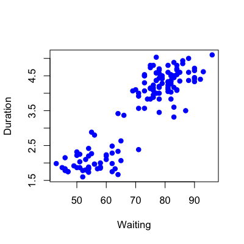
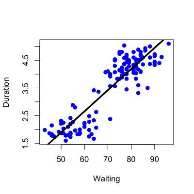
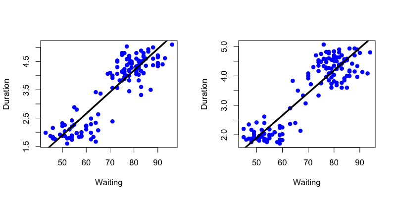
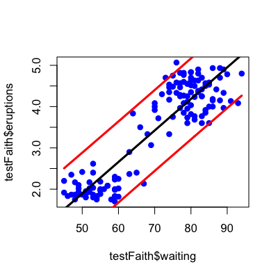
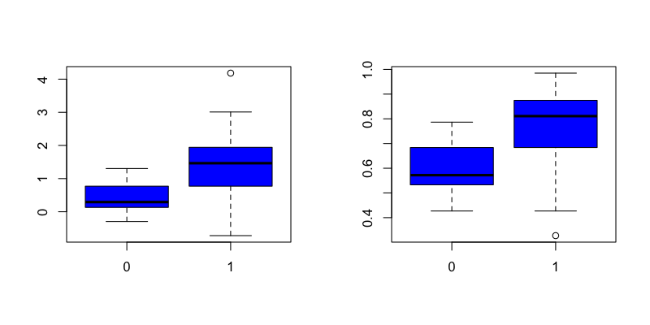

## Key ideas

* Use a standard regression model
  * lm
  * glm
* Predict new values with the coefficients
* Useful when the linear model is (nearly) correct

__Pros__:
* Easy to implement
* Easy to interpret

__Cons__:
* Often poor performance in nonlinear settings


---

## Example: Old faithful eruptions


Image Credit/Copyright Wally Pacholka [http://www.astropics.com/](http://www.astropics.com/)

---

## Example: Old faithful eruptions


```r
data(faithful)
dim(faithful)
```

```
[1] 272   2
```

```r
set.seed(333)
trainSamples <- sample(1:272,size=(272/2),replace=F)
trainFaith <- faithful[trainSamples,]
testFaith <- faithful[-trainSamples,]
head(trainFaith)
```

```
    eruptions waiting
128     4.500      82
23      3.450      78
263     1.850      58
154     4.600      81
6       2.883      55
194     4.100      84
```


---

## Eruption duration versus waiting time


```r
plot(trainFaith$waiting,trainFaith$eruptions,pch=19,col="blue",xlab="Waiting",ylab="Duration")
```

<div class="rimage center"></div>


---

## Fit a linear model 

$$ ED_i = b_0 + b_1 WT_i + e_i $$


```r
lm1 <- lm(eruptions ~ waiting,data=trainFaith)
summary(lm1)
```

```

Call:
lm(formula = eruptions ~ waiting, data = trainFaith)

Residuals:
    Min      1Q  Median      3Q     Max 
-1.2969 -0.3543  0.0487  0.3310  1.0760 

Coefficients:
            Estimate Std. Error t value Pr(>|t|)    
(Intercept) -1.92491    0.22925    -8.4  5.8e-14 ***
waiting      0.07639    0.00316    24.2  < 2e-16 ***
---
Signif. codes:  0 '***' 0.001 '**' 0.01 '*' 0.05 '.' 0.1 ' ' 1 

Residual standard error: 0.494 on 134 degrees of freedom
Multiple R-squared: 0.814,	Adjusted R-squared: 0.812 
F-statistic:  585 on 1 and 134 DF,  p-value: <2e-16 
```


---
## Model fit


```r
plot(trainFaith$waiting,trainFaith$eruptions,pch=19,col="blue",xlab="Waiting",ylab="Duration")
lines(trainFaith$waiting,lm1$fitted,lwd=3)
```

<div class="rimage center"></div>


---

## Predict a new value

$$\hat{ED} = \hat{b}_0 + \hat{b}_1 WT$$


```r
coef(lm1)[1] + coef(lm1)[2]*80
```

```
(Intercept) 
      4.186 
```

```r
newdata <- data.frame(waiting=80)
predict(lm1,newdata)
```

```
    1 
4.186 
```


---

## Plot predictions - training and test


```r
par(mfrow=c(1,2))
plot(trainFaith$waiting,trainFaith$eruptions,pch=19,col="blue",xlab="Waiting",ylab="Duration")
lines(trainFaith$waiting,predict(lm1),lwd=3)
plot(testFaith$waiting,testFaith$eruptions,pch=19,col="blue",xlab="Waiting",ylab="Duration")
lines(testFaith$waiting,predict(lm1,newdata=testFaith),lwd=3)
```

<div class="rimage center"></div>


---

## Get training set/test set errors


```r
# Calculate RMSE on training
sqrt(sum((lm1$fitted-trainFaith$eruptions)^2))
```

```
[1] 5.713
```

```r

# Calculate RMSE on test
sqrt(sum((predict(lm1,newdata=testFaith)-testFaith$eruptions)^2))
```

```
[1] 5.827
```


---

## Prediction intervals


```r
pred1 <- predict(lm1,newdata=testFaith,interval="prediction")
ord <- order(testFaith$waiting)
plot(testFaith$waiting,testFaith$eruptions,pch=19,col="blue")
matlines(testFaith$waiting[ord],pred1[ord,],type="l",,col=c(1,2,2),lty = c(1,1,1), lwd=3)
```

<div class="rimage center"></div>


---

## Example with binary data: Baltimore Ravens


[http://espn.go.com/nfl/team/_/name/bal/baltimore-ravens](http://espn.go.com/nfl/team/_/name/bal/baltimore-ravens)

---

## Ravens Data


```r
download.file("https://dl.dropbox.com/u/7710864/data/ravensData.rda",
              destfile="./data/ravensData.rda",method="curl")
load("./data/ravensData.rda")
head(ravensData)
```

```
  ravenWinNum ravenWin ravenScore opponentScore
1           1        W         24             9
2           1        W         38            35
3           1        W         28            13
4           1        W         34            31
5           1        W         44            13
6           0        L         23            24
```


---

## Fit a logistic regression

$$logit(E[RW_i | RS_i]) = b_0 + b_1 RS_i$$

```r
glm1 <- glm(ravenWinNum ~ ravenScore,family="binomial",data=ravensData)
par(mfrow=c(1,2))
boxplot(predict(glm1) ~ ravensData$ravenWinNum,col="blue")
boxplot(predict(glm1,type="response") ~ ravensData$ravenWinNum,col="blue")
```

<div class="rimage center"></div>


---

## Choosing a cutoff (re-substitution)


```r
xx <- seq(0,1,length=10); err <- rep(NA,10)
for(i in 1:length(xx)){
  err[i] <- sum((predict(glm1,type="response") > xx[i]) != ravensData$ravenWinNum)
}
plot(xx,err,pch=19,xlab="Cutoff",ylab="Error")
```

<div class="rimage center"></div>


---

## Comparing models with cross validation


```r
library(boot)
cost <- function(win, pred = 0) mean(abs(win-pred) > 0.5)
glm1 <- glm(ravenWinNum ~ ravenScore,family="binomial",data=ravensData)
glm2 <- glm(ravenWinNum ~ ravenScore,family="gaussian",data=ravensData)
cv1 <- cv.glm(ravensData,glm1,cost,K=3)
cv2 <- cv.glm(ravensData,glm2,cost,K=3)
cv1$delta
```

```
[1] 0.350 0.365
```

```r
cv2$delta
```

```
[1] 0.40 0.42
```


---

## Notes and further reading

* Regression models with multiple covariates can be included
* Often useful in combination with other models 
* [Elements of statistical learning](http://www-stat.stanford.edu/~tibs/ElemStatLearn/)
* [Modern applied statistics with S](http://www.amazon.com/Modern-Applied-Statistics-W-N-Venables/dp/0387954570)
