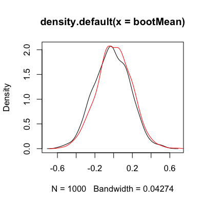
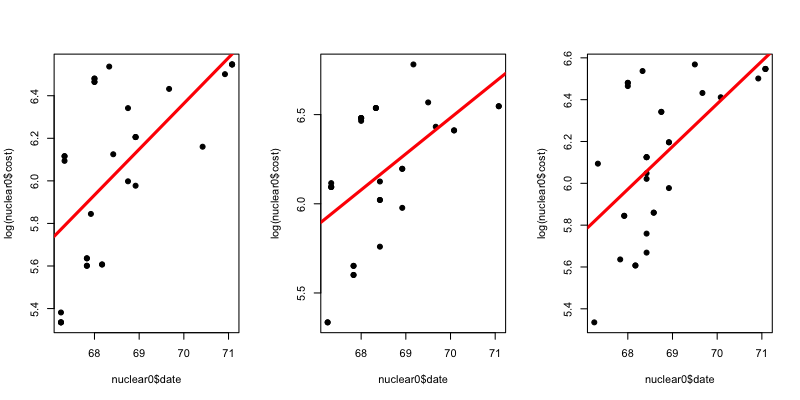
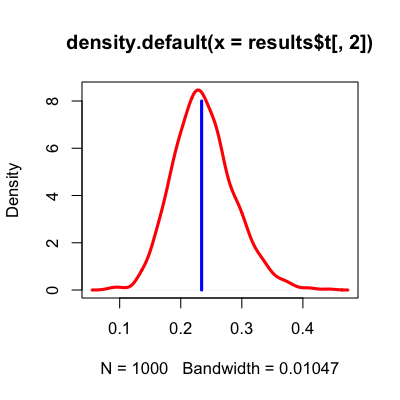
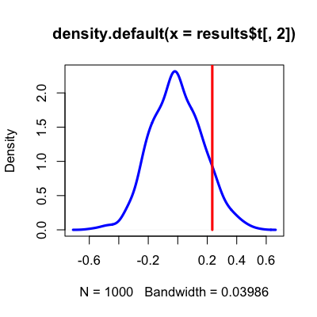
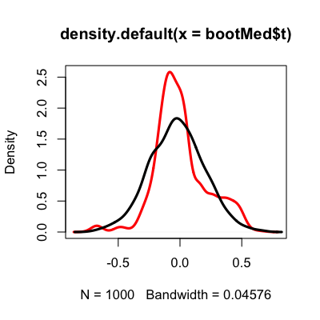
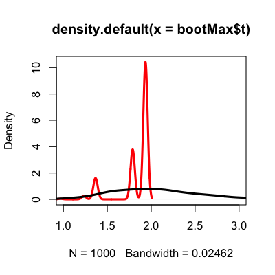

## Key ideas

* Treat the sample as if it were the population

__What it is good for__:

* Calculating standard errors
* Forming confidence intervals
* Performing hypothesis tests
* Improving predictors

---

## The "Central Dogma" of statistics


[http://www.gs.washington.edu/academics/courses/akey/56008/lecture/lecture5.pdf](http://www.gs.washington.edu/academics/courses/akey/56008/lecture/lecture5.pdf)


---

## The bootstrap


---

## Example


```r
set.seed(333); x <- rnorm(30)
bootMean <- rep(NA,1000); sampledMean <- rep(NA,1000)
for(i in 1:1000){bootMean[i] <- mean(sample(x,replace=TRUE))}
for(i in 1:1000){sampledMean[i] <- mean(rnorm(30))}
plot(density(bootMean)); lines(density(sampledMean),col="red")
```

<div class="rimage center"></div>


---

## Example with boot package


```r
set.seed(333); x <- rnorm(30); sampledMean <- rep(NA,1000)
for(i in 1:1000){sampledMean[i] <- mean(rnorm(30))}
meanFunc <- function(x,i){mean(x[i])}
bootMean <- boot(x,meanFunc,1000)
bootMean
```

```

ORDINARY NONPARAMETRIC BOOTSTRAP


Call:
boot(data = x, statistic = meanFunc, R = 1000)


Bootstrap Statistics :
    original    bias    std. error
t1* -0.01942 0.0006377       0.175
```


---

## Plotting boot package example


```r
plot(density(bootMean$t)); lines(density(sampledMean),col="red")
```

<div class="rimage center"></div>


---

## Nuclear costs


```r
library(boot); data(nuclear)
nuke.lm <- lm(log(cost) ~ date,data=nuclear)
plot(nuclear$date,log(nuclear$cost),pch=19)
abline(nuke.lm,col="red",lwd=3)
```

<div class="rimage center"></div>


---

## Nuclear costs


```r
par(mfrow=c(1,3))
for(i in 1:3){
  nuclear0 <- nuclear[sample(1:dim(nuclear)[1],replace=TRUE),]
  nuke.lm0 <- lm(log(cost) ~ date,data=nuclear0)
  plot(nuclear0$date,log(nuclear0$cost),pch=19)
  abline(nuke.lm0,col="red",lwd=3)
}
```

<div class="rimage center"></div>


---

## Bootstrap distribution


```r
bs <- function(data, indices,formula) {
  d <- data[indices,];fit <- lm(formula, data=d);return(coef(fit)) 
} 
results <- boot(data=nuclear, statistic=bs, R=1000, formula=log(cost) ~ date)
plot(density(results$t[,2]),col="red",lwd=3)
lines(rep(nuke.lm$coeff[2],10),seq(0,8,length=10),col="blue",lwd=3)
```

<div class="rimage center"></div>


[http://www.statmethods.net/advstats/bootstrapping.html](http://www.statmethods.net/advstats/bootstrapping.html)

---

## Bootstrap confidence intervals


```r
boot.ci(results)
```

```
BOOTSTRAP CONFIDENCE INTERVAL CALCULATIONS
Based on 1000 bootstrap replicates

CALL : 
boot.ci(boot.out = results)

Intervals : 
Level      Normal              Basic             Studentized     
95%   (-16.481,  -3.130 )   (-15.746,  -2.553 )   (-17.153,  -3.842 )  

Level     Percentile            BCa          
95%   (-17.435,  -4.242 )   (-17.475,  -4.249 )  
Calculations and Intervals on Original Scale
```


---

## Bootstrapping from a model


```r
resid <- rstudent(nuke.lm)
fit0 <- fitted(lm(log(cost) ~ 1,data=nuclear))
newNuc <- cbind(nuclear,resid=resid,fit0=fit0)
bs <- function(data, indices) {
  return(coef(glm(data$fit0 + data$resid[indices] ~ data$date,data=data)))
} 
results <- boot(data=newNuc, statistic=bs, R=1000)
```


---

## Results


```r
plot(density(results$t[,2]),lwd=3,col="blue")
lines(rep(coef(nuke.lm)[2],10),seq(0,3,length=10),col="red",lwd=3)
```

<div class="rimage center"></div>


---

## An empirical p-value 

$$ \hat{p} = \frac{1 + \sum_{b=1}^B |t_b^0| > |t|}{B+1}$$

```r
B <- dim(results$t)[1]
(1 + sum((abs(results$t[,2]) > abs(coef(nuke.lm)[2]))))/(B+1)
```

```
[1] 0.1838
```


---

## Bootstrapping non-linear statistics


```r
set.seed(555); x <- rnorm(30); sampledMed <- rep(NA,1000)
for(i in 1:1000){sampledMed[i] <- median(rnorm(30))}
medFunc <- function(x,i){median(x[i])}; bootMed <- boot(x,medFunc,1000)
plot(density(bootMed$t),col="red",lwd=3)
lines(density(sampledMed),lwd=3)
```

<div class="rimage center"></div>


---

## Things you can't bootstrap (max)


```r
set.seed(333); x <- rnorm(30); sampledMax <- rep(NA,1000)
for(i in 1:1000){sampledMax[i] <- max(rnorm(30))}
maxFunc <- function(x,i){max(x[i])}; bootMax <- boot(x,maxFunc,1000)
plot(density(bootMax$t),col="red",lwd=3,xlim=c(1,3))
lines(density(sampledMax),lwd=3)
```

<div class="rimage center"></div>


---

## Notes and further resources

__Notes__:

* Can be useful for complicated statistics
* Be careful near the boundaries
* Be careful with non-linear functions

__Further resources__:

* [Brian Caffo's bootstrap notes](http://ocw.jhsph.edu/courses/MethodsInBiostatisticsI/PDFs/lecture12.pdf)
* [Nice basic intro to boot package](http://www.mayin.org/ajayshah/KB/R/documents/boot.html)
* [Another basic boot tutorial](http://www.statmethods.net/advstats/bootstrapping.html)
* [An introduction to the bootstrap](http://www.amazon.com/Introduction-Bootstrap-Monographs-Statistics-Probability/dp/0412042312)
* [Confidence limits on phylogenies](http://www.jstor.org/discover/10.2307/2408678?uid=3739704&uid=2&uid=4&uid=3739256&sid=21101897412687)
