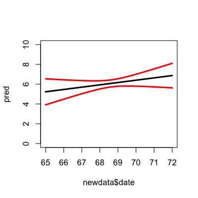
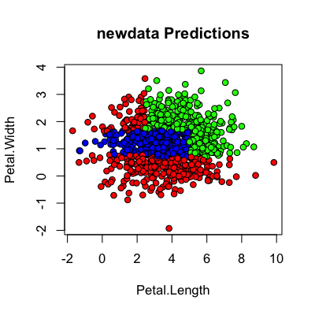

## Key ideas

* Bootstrapping can be used for
  * Cross-validation type error rates
  * Prediction errors in regression models
  * Improving prediction

---

## Bootstrapping prediction errors


```r
library(boot); data(nuclear)
nuke.lm <- lm(log(cost) ~ date,data=nuclear)
plot(nuclear$date,log(nuclear$cost),pch=19)
abline(nuke.lm,col="red",lwd=3)
```

<div class="rimage center"></div>


---

## Bootstrapping prediction errors


```r
newdata <- data.frame(date = seq(65,72,length=100))
nuclear <- cbind(nuclear,resid=rstudent(nuke.lm),fit=fitted(nuke.lm))
nuke.fun <- function(data,inds,newdata){
  lm.b <- lm(fit + resid[inds] ~ date,data=data)
  pred.b <- predict(lm.b,newdata)
  return(pred.b)
}
nuke.boot <- boot(nuclear,nuke.fun,R=1000,newdata=newdata)
head(nuke.boot$t)
```

```
      [,1]  [,2]  [,3]  [,4]  [,5]  [,6]  [,7]  [,8]  [,9] [,10] [,11] [,12] [,13] [,14] [,15]
[1,] 4.565 4.597 4.629 4.661 4.693 4.725 4.757 4.789 4.821 4.853 4.885 4.917 4.950 4.982 5.014
[2,] 6.453 6.450 6.447 6.444 6.441 6.438 6.435 6.432 6.429 6.426 6.423 6.420 6.417 6.414 6.411
[3,] 5.168 5.183 5.198 5.213 5.228 5.243 5.258 5.273 5.288 5.303 5.318 5.333 5.348 5.363 5.378
[4,] 5.401 5.413 5.425 5.437 5.449 5.461 5.473 5.485 5.497 5.509 5.521 5.533 5.545 5.557 5.569
[5,] 4.013 4.047 4.081 4.115 4.149 4.183 4.217 4.251 4.285 4.319 4.353 4.387 4.421 4.454 4.488
[6,] 6.263 6.261 6.259 6.258 6.256 6.254 6.252 6.250 6.248 6.246 6.245 6.243 6.241 6.239 6.237
     [,16] [,17] [,18] [,19] [,20] [,21] [,22] [,23] [,24] [,25] [,26] [,27] [,28] [,29] [,30]
[1,] 5.046 5.078 5.110 5.142 5.174 5.206 5.238 5.270 5.303 5.335 5.367 5.399 5.431 5.463 5.495
[2,] 6.408 6.405 6.402 6.399 6.396 6.393 6.390 6.387 6.384 6.381 6.377 6.374 6.371 6.368 6.365
[3,] 5.393 5.408 5.423 5.438 5.453 5.468 5.483 5.498 5.512 5.527 5.542 5.557 5.572 5.587 5.602
[4,] 5.581 5.593 5.605 5.617 5.629 5.641 5.653 5.665 5.677 5.689 5.701 5.713 5.725 5.737 5.749
[5,] 4.522 4.556 4.590 4.624 4.658 4.692 4.726 4.760 4.794 4.828 4.862 4.896 4.930 4.964 4.997
[6,] 6.235 6.233 6.232 6.230 6.228 6.226 6.224 6.222 6.221 6.219 6.217 6.215 6.213 6.211 6.209
     [,31] [,32] [,33] [,34] [,35] [,36] [,37] [,38] [,39] [,40] [,41] [,42] [,43] [,44] [,45]
[1,] 5.527 5.559 5.591 5.623 5.655 5.688 5.720 5.752 5.784 5.816 5.848 5.880 5.912 5.944 5.976
[2,] 6.362 6.359 6.356 6.353 6.350 6.347 6.344 6.341 6.338 6.335 6.332 6.329 6.326 6.323 6.320
[3,] 5.617 5.632 5.647 5.662 5.677 5.692 5.707 5.722 5.737 5.752 5.767 5.782 5.797 5.812 5.827
[4,] 5.761 5.773 5.785 5.797 5.809 5.821 5.833 5.845 5.857 5.869 5.881 5.893 5.905 5.917 5.929
[5,] 5.031 5.065 5.099 5.133 5.167 5.201 5.235 5.269 5.303 5.337 5.371 5.405 5.439 5.473 5.507
[6,] 6.208 6.206 6.204 6.202 6.200 6.198 6.196 6.195 6.193 6.191 6.189 6.187 6.185 6.184 6.182
     [,46] [,47] [,48] [,49] [,50] [,51] [,52] [,53] [,54] [,55] [,56] [,57] [,58] [,59] [,60]
[1,] 6.008 6.040 6.073 6.105 6.137 6.169 6.201 6.233 6.265 6.297 6.329 6.361 6.393 6.425 6.458
[2,] 6.317 6.314 6.311 6.308 6.305 6.302 6.299 6.296 6.293 6.290 6.287 6.284 6.281 6.278 6.275
[3,] 5.842 5.857 5.872 5.887 5.902 5.917 5.932 5.947 5.961 5.976 5.991 6.006 6.021 6.036 6.051
[4,] 5.941 5.953 5.965 5.977 5.989 6.001 6.013 6.025 6.037 6.049 6.061 6.073 6.085 6.097 6.109
[5,] 5.540 5.574 5.608 5.642 5.676 5.710 5.744 5.778 5.812 5.846 5.880 5.914 5.948 5.982 6.016
[6,] 6.180 6.178 6.176 6.174 6.172 6.171 6.169 6.167 6.165 6.163 6.161 6.159 6.158 6.156 6.154
     [,61] [,62] [,63] [,64] [,65] [,66] [,67] [,68] [,69] [,70] [,71] [,72] [,73] [,74] [,75]
[1,] 6.490 6.522 6.554 6.586 6.618 6.650 6.682 6.714 6.746 6.778 6.810 6.843 6.875 6.907 6.939
[2,] 6.272 6.269 6.266 6.263 6.260 6.257 6.254 6.251 6.248 6.245 6.242 6.239 6.236 6.233 6.230
[3,] 6.066 6.081 6.096 6.111 6.126 6.141 6.156 6.171 6.186 6.201 6.216 6.231 6.246 6.261 6.276
[4,] 6.121 6.133 6.145 6.157 6.169 6.181 6.193 6.205 6.217 6.229 6.241 6.253 6.265 6.277 6.289
[5,] 6.050 6.084 6.117 6.151 6.185 6.219 6.253 6.287 6.321 6.355 6.389 6.423 6.457 6.491 6.525
[6,] 6.152 6.150 6.148 6.146 6.145 6.143 6.141 6.139 6.137 6.135 6.134 6.132 6.130 6.128 6.126
     [,76] [,77] [,78] [,79] [,80] [,81] [,82] [,83] [,84] [,85] [,86] [,87] [,88] [,89] [,90]
[1,] 6.971 7.003 7.035 7.067 7.099 7.131 7.163 7.195 7.228 7.260 7.292 7.324 7.356 7.388 7.420
[2,] 6.227 6.224 6.221 6.218 6.215 6.212 6.209 6.206 6.203 6.200 6.197 6.194 6.191 6.188 6.185
[3,] 6.291 6.306 6.321 6.336 6.351 6.366 6.381 6.396 6.410 6.425 6.440 6.455 6.470 6.485 6.500
[4,] 6.301 6.313 6.325 6.337 6.349 6.361 6.373 6.385 6.397 6.409 6.421 6.433 6.445 6.457 6.469
[5,] 6.559 6.593 6.627 6.660 6.694 6.728 6.762 6.796 6.830 6.864 6.898 6.932 6.966 7.000 7.034
[6,] 6.124 6.122 6.121 6.119 6.117 6.115 6.113 6.111 6.109 6.108 6.106 6.104 6.102 6.100 6.098
     [,91] [,92] [,93] [,94] [,95] [,96] [,97] [,98] [,99] [,100]
[1,] 7.452 7.484 7.516 7.548 7.580 7.613 7.645 7.677 7.709  7.741
[2,] 6.182 6.179 6.176 6.173 6.170 6.167 6.164 6.161 6.158  6.155
[3,] 6.515 6.530 6.545 6.560 6.575 6.590 6.605 6.620 6.635  6.650
[4,] 6.481 6.493 6.505 6.517 6.529 6.541 6.553 6.565 6.577  6.589
[5,] 7.068 7.102 7.136 7.170 7.203 7.237 7.271 7.305 7.339  7.373
[6,] 6.097 6.095 6.093 6.091 6.089 6.087 6.085 6.084 6.082  6.080
```


---

## Bootstrapping prediction errors


```r
pred <- predict(nuke.lm,newdata)
predSds <- apply(nuke.boot$t,2,sd)
plot(newdata$date,pred,col="black",type="l",lwd=3,ylim=c(0,10))
lines(newdata$date,pred + 1.96*predSds,col="red",lwd=3)
lines(newdata$date,pred - 1.96*predSds,col="red",lwd=3)
```

<div class="rimage center"></div>


---

## Bootstrap aggregating (bagging)

__Basic idea__: 

1. Resample cases and recalculate predictions
2. Average or majority vote

__Notes__:

* Similar bias 
* Reduced variance
* More useful for non-linear functions


---

## Bagged loess


```r
library(ElemStatLearn); data(ozone,package="ElemStatLearn")
ozone <- ozone[order(ozone$ozone),]
head(ozone)
```

```
    ozone radiation temperature wind
17      1         8          59  9.7
19      4        25          61  9.7
14      6        78          57 18.4
45      7        48          80 14.3
106     7        49          69 10.3
7       8        19          61 20.1
```

[http://en.wikipedia.org/wiki/Bootstrap_aggregating](http://en.wikipedia.org/wiki/Bootstrap_aggregating)

---

## Bagged loess


```r
ll <- matrix(NA,nrow=10,ncol=155)
for(i in 1:10){
  ss <- sample(1:dim(ozone)[1],replace=T)
  ozone0 <- ozone[ss,]; ozone0 <- ozone0[order(ozone0$ozone),]
  loess0 <- loess(temperature ~ ozone,data=ozone0,span=0.2)
  ll[i,] <- predict(loess0,newdata=data.frame(ozone=1:155))
}
```


---

## Bagged loess


```r
plot(ozone$ozone,ozone$temperature,pch=19,cex=0.5)
for(i in 1:10){lines(1:155,ll[i,],col="grey",lwd=2)}
lines(1:155,apply(ll,2,mean),col="red",lwd=2)
```

<div class="rimage center"></div>


---

## Bagged trees

__Basic idea__:

1. Resample data
2. Recalculate tree
3. Average/[mode](http://en.wikipedia.org/wiki/Mode_(statistics)) of predictors 

__Notes__:

1. More stable
2. May not be as good as random forests


---

## Iris data


```r
data(iris)
head(iris)
```

```
  Sepal.Length Sepal.Width Petal.Length Petal.Width Species
1          5.1         3.5          1.4         0.2  setosa
2          4.9         3.0          1.4         0.2  setosa
3          4.7         3.2          1.3         0.2  setosa
4          4.6         3.1          1.5         0.2  setosa
5          5.0         3.6          1.4         0.2  setosa
6          5.4         3.9          1.7         0.4  setosa
```


---

## Bagging a tree


```r
library(ipred)
bagTree <- bagging(Species ~.,data=iris,coob=TRUE)
print(bagTree)
```

```

Bagging classification trees with 25 bootstrap replications 

Call: bagging.data.frame(formula = Species ~ ., data = iris, coob = TRUE)

Out-of-bag estimate of misclassification error:  0.06 
```


---

## Looking at bagged tree one


```r
bagTree$mtrees[[1]]$btree
```

```
n= 150 

node), split, n, loss, yval, (yprob)
      * denotes terminal node

 1) root 150 98 virginica (0.33333 0.32000 0.34667)  
   2) Petal.Length< 2.5 50  0 setosa (1.00000 0.00000 0.00000) *
   3) Petal.Length>=2.5 100 48 virginica (0.00000 0.48000 0.52000)  
     6) Petal.Width< 1.75 52  5 versicolor (0.00000 0.90385 0.09615)  
      12) Petal.Length< 4.9 46  2 versicolor (0.00000 0.95652 0.04348)  
        24) Petal.Width< 1.65 44  0 versicolor (0.00000 1.00000 0.00000) *
        25) Petal.Width>=1.65 2  0 virginica (0.00000 0.00000 1.00000) *
      13) Petal.Length>=4.9 6  3 versicolor (0.00000 0.50000 0.50000)  
        26) Sepal.Width>=2.65 3  0 versicolor (0.00000 1.00000 0.00000) *
        27) Sepal.Width< 2.65 3  0 virginica (0.00000 0.00000 1.00000) *
     7) Petal.Width>=1.75 48  1 virginica (0.00000 0.02083 0.97917)  
      14) Petal.Length< 4.85 3  1 virginica (0.00000 0.33333 0.66667)  
        28) Sepal.Length< 5.95 1  0 versicolor (0.00000 1.00000 0.00000) *
        29) Sepal.Length>=5.95 2  0 virginica (0.00000 0.00000 1.00000) *
      15) Petal.Length>=4.85 45  0 virginica (0.00000 0.00000 1.00000) *
```


---

## Looking at bagged tree two


```r
bagTree$mtrees[[2]]$btree
```

```
n= 150 

node), split, n, loss, yval, (yprob)
      * denotes terminal node

 1) root 150 98 versicolor (0.33333 0.34667 0.32000)  
   2) Petal.Length< 2.6 50  0 setosa (1.00000 0.00000 0.00000) *
   3) Petal.Length>=2.6 100 48 versicolor (0.00000 0.52000 0.48000)  
     6) Petal.Length< 4.85 51  3 versicolor (0.00000 0.94118 0.05882)  
      12) Petal.Width< 1.65 45  0 versicolor (0.00000 1.00000 0.00000) *
      13) Petal.Width>=1.65 6  3 versicolor (0.00000 0.50000 0.50000)  
        26) Sepal.Width>=3.1 3  0 versicolor (0.00000 1.00000 0.00000) *
        27) Sepal.Width< 3.1 3  0 virginica (0.00000 0.00000 1.00000) *
     7) Petal.Length>=4.85 49  4 virginica (0.00000 0.08163 0.91837)  
      14) Petal.Width< 1.75 8  4 versicolor (0.00000 0.50000 0.50000)  
        28) Petal.Length< 4.95 2  0 versicolor (0.00000 1.00000 0.00000) *
        29) Petal.Length>=4.95 6  2 virginica (0.00000 0.33333 0.66667)  
          58) Petal.Width>=1.55 2  0 versicolor (0.00000 1.00000 0.00000) *
          59) Petal.Width< 1.55 4  0 virginica (0.00000 0.00000 1.00000) *
      15) Petal.Width>=1.75 41  0 virginica (0.00000 0.00000 1.00000) *
```


---

## Random forests

1. Bootstrap samples
2. At each split, bootstrap variables
3. Grow multiple trees and vote

__Pros__:

1. Accuracy

__Cons__:

1. Speed
2. Interpretability
3. Overfitting


---

## Random forests

```r
library(randomForest)
forestIris <- randomForest(Species~ Petal.Width + Petal.Length,data=iris,prox=TRUE)
forestIris
```

```

Call:
 randomForest(formula = Species ~ Petal.Width + Petal.Length,      data = iris, prox = TRUE) 
               Type of random forest: classification
                     Number of trees: 500
No. of variables tried at each split: 1

        OOB estimate of  error rate: 3.33%
Confusion matrix:
           setosa versicolor virginica class.error
setosa         50          0         0        0.00
versicolor      0         47         3        0.06
virginica       0          2        48        0.04
```


---

## Getting a single tree


```r
getTree(forestIris,k=2)
```

```
   left daughter right daughter split var split point status prediction
1              2              3         2        2.45      1          0
2              0              0         0        0.00     -1          1
3              4              5         1        1.70      1          0
4              6              7         1        1.55      1          0
5              0              0         0        0.00     -1          3
6              8              9         1        1.35      1          0
7              0              0         0        0.00     -1          2
8              0              0         0        0.00     -1          2
9             10             11         1        1.45      1          0
10            12             13         2        5.20      1          0
11             0              0         0        0.00     -1          2
12             0              0         0        0.00     -1          2
13             0              0         0        0.00     -1          3
```


---

## Class "centers"


```r
iris.p <- classCenter(iris[,c(3,4)], iris$Species, forestIris$prox)
plot(iris[,3], iris[,4], pch=21, xlab=names(iris)[3], ylab=names(iris)[4],
bg=c("red", "blue", "green")[as.numeric(factor(iris$Species))],
main="Iris Data with Prototypes")
points(iris.p[,1], iris.p[,2], pch=21, cex=2, bg=c("red", "blue", "green"))
```

<div class="rimage center"></div>


---

## Combining random forests


```r
forestIris1 <- randomForest(Species~Petal.Width + Petal.Length,data=iris,prox=TRUE,ntree=50)
forestIris2 <- randomForest(Species~Petal.Width + Petal.Length,data=iris,prox=TRUE,ntree=50)
forestIris3 <- randomForest(Species~Petal.Width + Petal.Length,data=iris,prox=TRUE,nrtee=50)
combine(forestIris1,forestIris2,forestIris3)
```

```

Call:
 randomForest(formula = Species ~ Petal.Width + Petal.Length,      data = iris, prox = TRUE, ntree = 50) 
               Type of random forest: classification
                     Number of trees: 600
No. of variables tried at each split: 1
```


---

## Predicting new values


```r
newdata <- data.frame(Sepal.Length<- rnorm(1000,mean(iris$Sepal.Length),
                                           sd(iris$Sepal.Length)),
                      Sepal.Width <- rnorm(1000,mean(iris$Sepal.Width),
                                           sd(iris$Sepal.Width)),
                      Petal.Width <- rnorm(1000,mean(iris$Petal.Width),
                                           sd(iris$Petal.Width)),
                      Petal.Length <- rnorm(1000,mean(iris$Petal.Length),
                                            sd(iris$Petal.Length)))

pred <- predict(forestIris,newdata)
```


---

## Predicting new values


```r
plot(newdata[,4], newdata[,3], pch=21, xlab="Petal.Length",ylab="Petal.Width",
bg=c("red", "blue", "green")[as.numeric(pred)],main="newdata Predictions")
```

<div class="rimage center"></div>


---

## Notes and further resources

__Notes__:

* Bootstrapping is useful for nonlinear models
* Care should be taken to avoid overfitting (see [rfcv](http://cran.r-project.org/web/packages/randomForest/randomForest.pdf) funtion)
* Out of bag estimates are efficient estimates of test error

__Further resources__:

* [Random forests](http://www.stat.berkeley.edu/~breiman/RandomForests/cc_home.htm)
* [Random forest Wikipedia](http://en.wikipedia.org/wiki/Random_forest)
* [Bagging](http://en.wikipedia.org/wiki/Bootstrap_aggregating)
* [Bagging and boosting](http://stat.ethz.ch/education/semesters/FS_2008/CompStat/sk-ch8.pdf)
